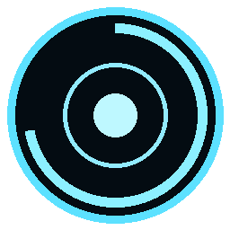
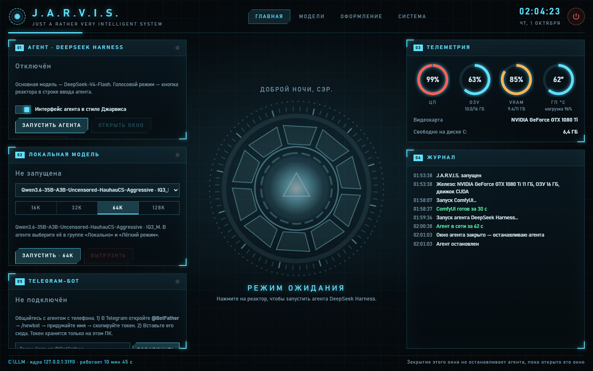
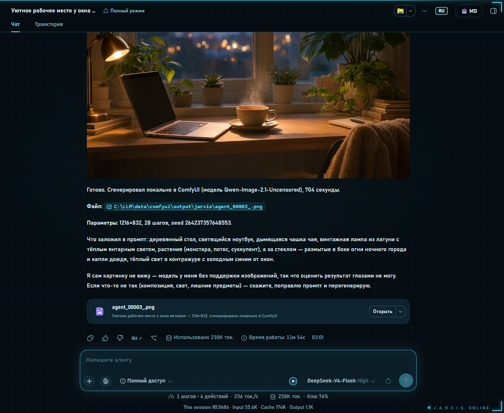
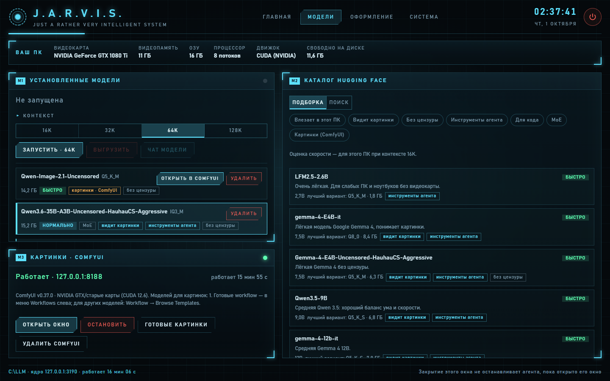
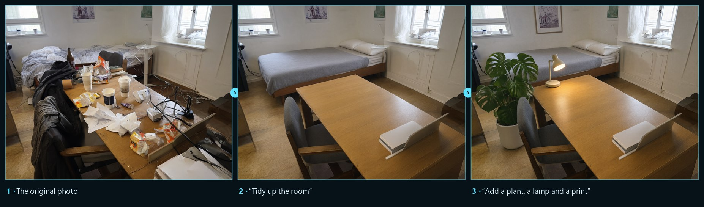
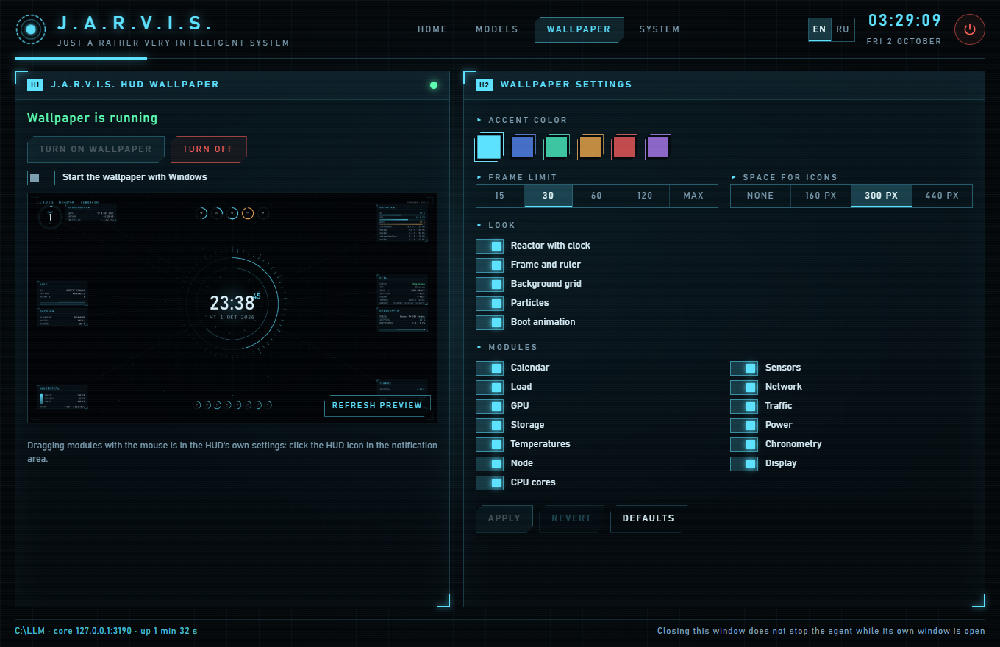
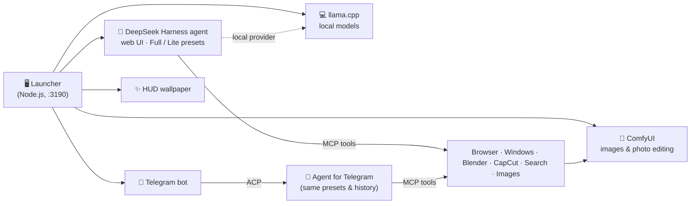
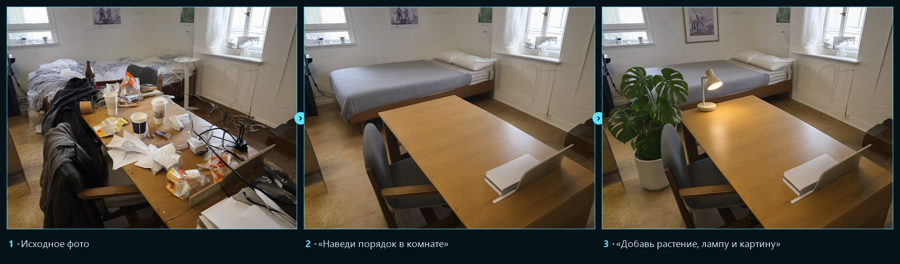

# J.A.R.V.I.S.

**Your own AI assistant for Windows — an agent that actually works on your PC.**

Built on **[DeepSeek Harness](https://github.com/deepseek-ai/deepseek-harness)** · local models · image generation & photo editing · Telegram bot · a sci‑fi interface

**[⬇ Download](../../releases/latest)** · **[Features](#features)** · **[Quick start](#quick-start)** · **[Русская версия ↓](#-русский)**

> [!NOTE]
> **J.A.R.V.I.S. is powered by [DeepSeek Harness](https://github.com/deepseek-ai/deepseek-harness)** — DeepSeek's open agent runtime.
> This project packs it into a one‑click Windows app and adds everything around it: a launcher, local models, image tools,
> a Telegram bot, voice mode and a live HUD wallpaper. The interface is in **English or Russian**.

## Why you'll like it

- 🧠 **It does things, not just talks.** Files, commands, the browser, Windows apps, Blender, CapCut — you describe the task, the agent does it on your PC.
- 💻 **Runs on any PC.** The launcher checks your GPU and RAM and tells you which local models will fly and which won't. No GPU? Still works.
- 🎨 **Draws and edits photos.** "Tidy up this room", "put a vase on the table" — send a photo, get it back edited. Free, offline.
- 📱 **Talk to it from your phone.** Pair your Telegram in 10 seconds; risky actions wait for your ✅.
- 🛡️ **Safe by default.** The agent can't touch your keys and passwords, deletions need your approval, and your API keys never leave your PC.
- ⚡ **One installer, zero setup.** Node.js, Python, the agent and the engines are bundled inside — nothing to install system‑wide, no admin rights.
- 🌐 **English or Russian.** Pick the language in the installer; switch it any time in the launcher (EN / RU) — the launcher, agent, voice, Telegram bot and HUD all follow.

## Features

### 🧠 A real agent, not a chatbot

The agent (DeepSeek‑V4 by default) plans the task, uses tools and reports back. **Full mode** gives it everything:
browser automation (Playwright), Windows UI control, Blender, CapCut drafts, web search, Wolfram, draw.io diagrams,
up‑to‑date library docs (Context7) and image generation. **Lite mode** keeps the toolset small for local models.
There's a **voice mode** too — Jarvis answers out loud, briefly and politely, "sir".

### 💻 Local models for any hardware

A built‑in **Hugging Face catalog** with filters (*fits this PC*, *vision*, *agent tools*, *coding*, *MoE*, *images*).
For every variant the launcher estimates **Fast / OK / Slow / Won't fit** for *your* GPU and RAM and stars the best one.
One click to download (resumable, SHA‑256 verified), pick a context size from 16K to 128K, start —
and the model appears in the agent. NVIDIA (CUDA), AMD/Intel (Vulkan) and CPU‑only builds are chosen automatically.

### 🎨 Draw and edit photos

Image models from the catalog run in **ComfyUI**, which the launcher installs with one button — the build is picked for your GPU.
Then just ask the agent: *"draw…"* or *"here's a photo, tidy up the room"*. Photo editing keeps the framing, the lighting
and everything you didn't ask to change. Ready‑made ComfyUI workflows are created too, if you prefer to do it by hand.

Generated and edited locally on a GTX 1080 Ti with Qwen‑Image 2.1 (GGUF), about 5 minutes per edit.

### 📱 Your assistant in Telegram

Create a bot with @BotFather, paste the token into the launcher, send the pairing code — done.
Write tasks from anywhere; progress streams into the message. `/model` switches between DeepSeek and your local
models with buttons, `/mode` between Full and Lite. Photos you send go straight to the agent; pictures it draws come back as photos.
Only your paired accounts can talk to it, and every risky action arrives as **✅ Allow / ❌ Reject** buttons.

### ✨ Live HUD wallpaper

An animated **HUD on the desktop** — the arc reactor, a clock, CPU / GPU / RAM sensors — plus a themed agent window.
The wallpaper is optional and off by default: tick it in the installer, then turn it on in the launcher's **Wallpaper** tab.
Windows itself keeps its own look: J.A.R.V.I.S. doesn't touch the taskbar, icons, cursors or the lock screen.

## Quick start

1. Download **`JARVIS-Setup.exe`** from **[Releases](../../releases/latest)**.
2. Run it. If Windows SmartScreen appears: **More info → Run anyway** (the installer isn't code‑signed).
3. Pick the components you want — the installer checks what depends on what. Takes 2–5 minutes; almost everything is already inside.
4. Start **J.A.R.V.I.S.** from the desktop shortcut → **Start agent** → enter your DeepSeek API key
   ([platform.deepseek.com](https://platform.deepseek.com) → API keys). Local models don't need a key at all.

## Requirements

| | Minimum | Recommended |
|---|---|---|
| OS | Windows 10 / 11, 64‑bit | Windows 11 |
| RAM | 8 GB | 16 GB+ |
| GPU | not required | 6 GB+ VRAM for local models and images |
| Disk | ~4 GB | + space for models (2–20 GB each) |
| Cloud agent | own DeepSeek API key (pay‑as‑you‑go, cents per task) | — |

## How it works

Everything lives in one folder: the launcher starts and supervises the agent, local models, ComfyUI and the bot,
keeps an eye on VRAM so they don't fight over it, and changes nothing outside its folder.

## Privacy & safety

- 🔑 Your DeepSeek key and Telegram token are stored **only on your PC** and are sent only to their own services.
- 🚫 Access rules: files with keys and passwords (`.env`, `.pem`, `.ssh`, credentials) are off‑limits to the agent;
  deleting files and system commands require your confirmation — in the app and in Telegram.
- 🏠 Local models and image tools work **fully offline**.
- 🧹 Clean uninstall: *Start → Uninstall J.A.R.V.I.S.* removes the folder, the shortcuts and autostart.

## Build from source

This repository holds the sources; the working install lives in its own folder (e.g. `C:\LLM`).

| Folder | What's inside |
|---|---|
| `launcher/` | Launcher core (`server.js`), modules (`lib/`), UI (`ui/`), tray script, icon |
| `agent/` | Agent plugins (Jarvis theme & voice, ACP preset join), Full/Lite presets, skills, access rules |
| `tools/` | Image MCP server (ComfyUI), Telegram bot, Blender & CapCut helpers |
| `installer/` | WPF installer (`Installer.cs`, `ui.xaml`) and `build.ps1` (bundles, secret scan, signing) |
| `docs/` | `УСТРОЙСТВО.md` — layout of the working install, guides |
| `hud/` | Live wallpaper (Rust) |

`sync.ps1` copies sources from the working install into the repo (with a secret scan) and back;
`installer\build.ps1` builds `JARVIS-Setup.exe`. See [РАЗРАБОТКА.md](РАЗРАБОТКА.md).

## Built with

[DeepSeek Harness](https://github.com/deepseek-ai/deepseek-harness) ·
[llama.cpp](https://github.com/ggml-org/llama.cpp) ·
[ComfyUI](https://github.com/Comfy-Org/ComfyUI) ·
[ComfyUI‑GGUF](https://github.com/leejet/ComfyUI-GGUF) ·
[Qwen‑Image](https://huggingface.co/Qwen) ·
[Playwright MCP](https://github.com/microsoft/playwright-mcp) ·
[Windows‑MCP](https://github.com/CursorTouch/Windows-MCP) ·
[BlenderMCP](https://github.com/ahujasid/blender-mcp) ·
[VectCutAPI](https://github.com/sun-guannan/VectCutAPI) ·
[edge‑tts](https://github.com/rany2/edge-tts) ·
[uv](https://github.com/astral-sh/uv) · [Node.js](https://nodejs.org)

## License & contributing

J.A.R.V.I.S. is released under the **[MIT License](LICENSE)**; bundled and downloaded third‑party components keep their
own licenses — see [THIRD-PARTY-NOTICES.md](THIRD-PARTY-NOTICES.md). Bugs and ideas: [issues](../../issues/new/choose)
and [Discussions](../../discussions); pull requests are welcome — [CONTRIBUTING.md](CONTRIBUTING.md).

**If J.A.R.V.I.S. made your PC a bit more sci‑fi — give it a ⭐, it really helps the project grow.**

A fan project, not affiliated with Marvel, Disney or DeepSeek. Iron Man and J.A.R.V.I.S. are trademarks of Marvel.

---

# 🇷🇺 Русский

**Свой ИИ‑ассистент для Windows — агент, который реально работает на вашем ПК.**

Построен на **[DeepSeek Harness](https://github.com/deepseek-ai/deepseek-harness)** · локальные модели · генерация и редактирование фото · Telegram‑бот · интерфейс как в фантастике

**[⬇ Скачать](../../releases/latest)** · **[Возможности](#возможности)** · **[Быстрый старт](#быстрый-старт)** · **[English ↑](#jarvis)**

> [!NOTE]
> **J.A.R.V.I.S. работает на [DeepSeek Harness](https://github.com/deepseek-ai/deepseek-harness)** — открытом агентном движке DeepSeek.
> Этот проект упаковывает его в Windows‑приложение, которое ставится в пару кликов, и добавляет всё вокруг: лаунчер,
> локальные модели, работу с картинками, Telegram‑бота, голосовой режим и живые обои‑HUD.

## Почему он вам понравится

- 🧠 **Он делает, а не только отвечает.** Файлы, команды, браузер, программы Windows, Blender, CapCut — вы описываете задачу, агент выполняет её на вашем ПК.
- 💻 **Под любое железо.** Лаунчер смотрит на видеокарту и память и сразу говорит, какие локальные модели полетят, а какие нет. Нет видеокарты — тоже работает.
- 🎨 **Рисует и редактирует фото.** «Наведи порядок в комнате», «поставь на стол вазу» — присылаете фото, получаете готовое. Бесплатно и без интернета.
- 📱 **Пишите ему с телефона.** Telegram привязывается за 10 секунд, рискованные действия ждут вашего ✅.
- 🛡️ **Безопасно по умолчанию.** Агент не трогает ключи и пароли, удаление — только с вашего разрешения, ваши ключи никуда не уходят с ПК.
- ⚡ **Один установщик — никакой настройки.** Node.js, Python, агент и движки уже внутри: ничего не ставится в систему, права администратора не нужны.
- 🌐 **Английский или русский.** Язык выбирается в установщике и меняется в лаунчере в любой момент (EN / RU) — лаунчер, агент, голос, Telegram-бот и обои переключаются вместе.

## Возможности

### 🧠 Настоящий агент, а не чат‑бот

Агент (по умолчанию DeepSeek‑V4) планирует задачу, пользуется инструментами и докладывает результат. В **полном режиме**
у него всё: управление браузером (Playwright) и окнами Windows, Blender, монтаж в CapCut, веб‑поиск, Wolfram, схемы draw.io,
свежая документация библиотек (Context7) и генерация картинок. **Лёгкий режим** держит набор инструментов компактным для локальных моделей.
Есть и **голосовой режим**: Джарвис отвечает вслух — коротко, учтиво, «сэр».

### 💻 Локальные модели под любое железо

Встроенный **каталог Hugging Face** с фильтрами («влезает в этот ПК», «видит картинки», «инструменты агента», «для кода», MoE, «картинки»).
Для каждого варианта модели лаунчер оценивает «Быстро / Нормально / Медленно / Не влезет» именно для вашей видеокарты и памяти
и отмечает лучший. Скачивание в один клик (с докачкой и проверкой SHA‑256), контекст от 16K до 128K, запуск — и модель уже в агенте.
Сборка движка под NVIDIA (CUDA), AMD/Intel (Vulkan) или процессор выбирается сама.

### 🎨 Рисование и редактирование фото

Модели для картинок из каталога работают в **ComfyUI**, который лаунчер ставит одной кнопкой — сборка подбирается под вашу видеокарту.
Дальше просто попросите агента: «нарисуй…» или «вот фото, наведи порядок в комнате». При редактировании сохраняются кадр,
свет и всё, что вы не просили менять. Для ручной работы в ComfyUI создаются готовые workflow.

Сгенерировано и отредактировано локально на GTX 1080 Ti моделью Qwen‑Image 2.1 (GGUF), около 5 минут на правку.

### 📱 Ваш ассистент в Telegram

Создайте бота у @BotFather, вставьте токен в лаунчер, отправьте код привязки — готово. Пишите задачи откуда угодно,
ход работы виден прямо в сообщении. `/model` переключает DeepSeek и ваши локальные модели кнопками, `/mode` — полный и лёгкий режим.
Фото из чата уходят агенту, нарисованные им картинки приходят фотографиями. Бот отвечает только привязанным аккаунтам,
а каждое рискованное действие приходит кнопками **✅ Разрешить / ❌ Отклонить**.

### ✨ Живые обои‑HUD

Анимированный **HUD на рабочем столе** — реактор, часы, датчики процессора, видеокарты и памяти — и оформленное окно агента.
Обои необязательны и по умолчанию выключены: отметьте их в установщике и включите в лаунчере на вкладке **«Обои»**.
Сама Windows остаётся как есть: панель задач, значки, курсоры и экран блокировки J.A.R.V.I.S. не трогает.

## Быстрый старт

1. Скачайте **`JARVIS-Setup.exe`** в разделе **[Releases](../../releases/latest)**.
2. Запустите. Если Windows покажет SmartScreen: **Подробнее → Выполнить в любом случае** (у установщика нет платной подписи).
3. Отметьте нужные компоненты — установщик сам следит за зависимостями. 2–5 минут, почти всё уже внутри.
4. Запустите **J.A.R.V.I.S.** ярлыком на рабочем столе → **Запустить агента** → введите свой ключ DeepSeek
   ([platform.deepseek.com](https://platform.deepseek.com) → API keys). Локальным моделям ключ не нужен вовсе.

## Требования

| | Минимум | Рекомендуется |
|---|---|---|
| Система | Windows 10 / 11, 64‑bit | Windows 11 |
| ОЗУ | 8 ГБ | 16 ГБ и больше |
| Видеокарта | не обязательна | от 6 ГБ видеопамяти для локальных моделей и картинок |
| Диск | ~4 ГБ | + место под модели (2–20 ГБ каждая) |
| Облачный агент | свой ключ DeepSeek (оплата по факту, копейки за задачу) | — |

## Приватность и безопасность

- 🔑 Ключ DeepSeek и токен Telegram хранятся **только на вашем ПК** и отправляются только в свои сервисы.
- 🚫 Правила доступа: файлы с ключами и паролями (`.env`, `.pem`, `.ssh`, credentials) агенту недоступны;
  удаление файлов и системные команды — только после подтверждения, и в приложении, и в Telegram.
- 🏠 Локальные модели и работа с картинками — **полностью офлайн**.
- 🧹 Чистое удаление: «Пуск» → «Удалить J.A.R.V.I.S.» убирает папку, ярлыки и автозапуск.

## Сборка из исходников

Здесь лежат исходники; рабочая установка — в отдельной папке (например, `C:\LLM`). `sync.ps1` переносит исходники
из рабочей установки в репозиторий (с проверкой на ключи) и обратно, `installer\build.ps1` собирает `JARVIS-Setup.exe`.
Подробнее — [РАЗРАБОТКА.md](РАЗРАБОТКА.md), устройство рабочей папки — [docs/УСТРОЙСТВО.md](docs/УСТРОЙСТВО.md).

## Лицензия и участие

J.A.R.V.I.S. распространяется под **[лицензией MIT](LICENSE)**; сторонние компоненты сохраняют свои лицензии —
см. [THIRD-PARTY-NOTICES.md](THIRD-PARTY-NOTICES.md). Ошибки и идеи — в [issues](../../issues/new/choose)
и [Discussions](../../discussions); pull request'ы приветствуются — [CONTRIBUTING.md](CONTRIBUTING.md).

**Если J.A.R.V.I.S. сделал ваш ПК чуточку фантастичнее — поставьте ⭐, это правда помогает проекту расти.**

Фанатский проект, не связан с Marvel, Disney или DeepSeek. Iron Man и J.A.R.V.I.S. — товарные знаки Marvel.
